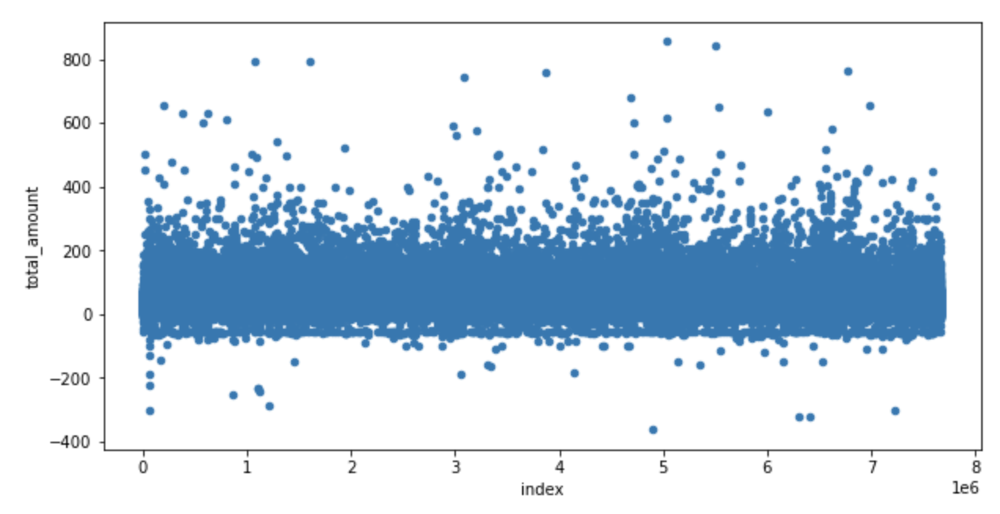
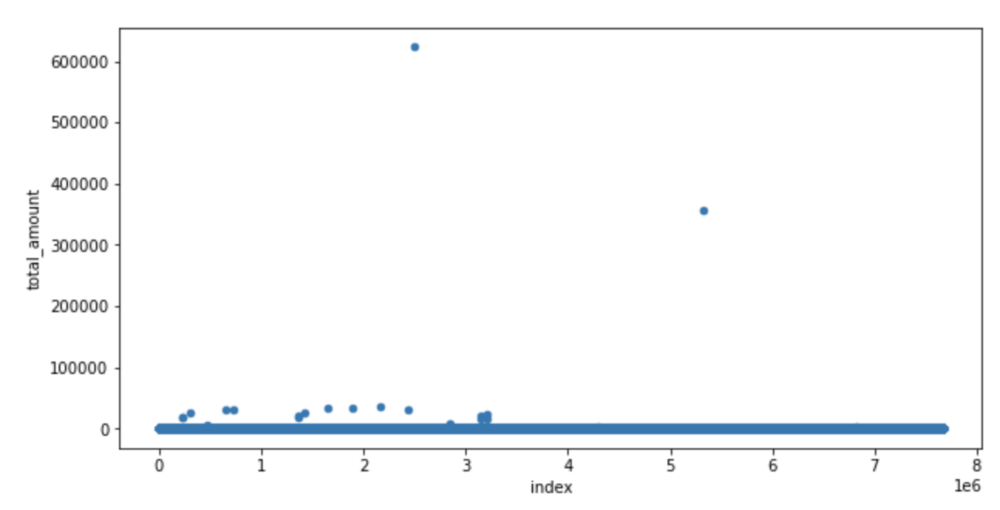
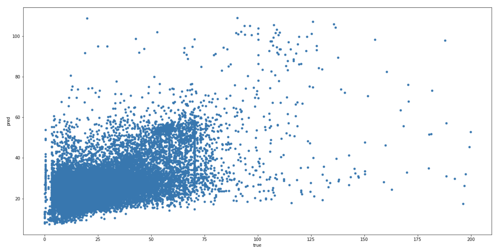

# Taxi DataSet
## Problem Definition
New York City has a lot of taxi drivers, all trying to make a fair wage.  But if every taxi only went to the most popular areas there would be an uneven supply - too much in some areas, too little in others. Our goal is to predict the average dollar amount spent on a taxi ride for each area (borough) of New York City in a given day and hour

This is a supervised regression problem.  It is supervised because we actually do have the value of the amounts we are attempting to predict.  It is a regression problem because we are working with a continuous (quantitative) variable instead of a categorical one.

Without this tool there could be over saturation of drivers in the most popular areas while other areas of the city suffer from unpredictable or unavailable service.

## Data Problems I Fixed
In any large dataset (this one has over 7M datapoints) there are bound to be problems and issues, that is part of the project.  Here are some of the problems I encountered and how I fixed or mitigated them.

### 1. Negative Total Amount Values
I removed the negative taxi fare amounts because they are probably erroneous data points - and there weren’t many of them.

### 2. Zero Values
I did the same for Zero Value datapoints. They were removed also.

### 3.  Too High
Some datapoints were as high as $600K for a taxi ride. Even for NYC, this seems excessive! So I came up with an upper limit of $200 to contrast with the average / mean taxi fare of ~$16.

Out of 7,667,792 datapoints there were only 1166 greater than $200 so this did not impact the overall dataset in a negative way.  Rather, it allowed me to correct for likely additional errors in the dataset for a more accurate model.

### Original features of the model
This is the list of features that could be used for model development that came with the original data: [‘PULocationID’, ‘transaction_date’,’ transaction_month’,’ transaction_day’, ‘transaction_hour’, ‘trip_distance’,’ total_amount’, ‘count_of_transactions’]
You can refer to  [this document](https://www1.nyc.gov/assets/tlc/downloads/pdf/data_dictionary_trip_records_yellow.pdf)  for the meaning of each feature.

### Feature engineering
Here are three sets of new features that I added to the model. 

#### 1. Time-based features. 
These include, weekend and holiday boolean.

#### 2. Location-based information. 
We have Location IDs per region but there is a higher level abstraction for the regions in NYC which are called Boroughs. This information came from the source of the main data.

#### 3. Weather related data. 
I have downloaded this data from this website. It’s free to use for development.

#### List of Features - Final Model
Here is a list of all features used in the final model: [‘PULocationID’, ‘transaction_month’, ‘transaction_day’, ‘transaction_hour’, ‘transaction_week_day’, ‘weekend’, ‘is_holiday’, ‘Borough’, ‘temperature’, ‘humidity’, ‘wind speed’, ‘cloud cover’, ‘amount of precipitation’, ‘total_amount’]

#### Unsolved Questions to Explore in the Future
One area I plan to explore in the future is a better look at the precipitation column.  I still have many questions such as:

* Is precipitation in cm or inches? (I suspect cm from the amounts)
* Is this precipitation rain or snow? 
* What is the impact of a rainy day vs. a snowy day on revenues?

### Algorithm Selection & Results
The algorithms I selected were
* Decision Trees (benchmark)
* Random Forest
* Gradient Boosting. 

In the benchmark Decision Tree model, I only included the original features of the model as stated above. 
And on the normal models I used all original features plus the newly created ones.

Here are the performance results before tuning:

| Algorithm         | MAE   | RMSE   | R2    |
|-------------------|-------|--------|-------|
| Benchmark model   | 9.778 | 14.739 | 0.225 |
| Decision tree     | 8.534 | 14.011 | 0.308 |
| Random forest     | 7.426 | 13.212 | 0.385 |
| Gradient boosting | 8.388 | 13.378 | 0.369 |

The Random Forest model is selected to be tuned. Here are the best parameter values: n_estimators: 1800 min_samples_split: 2 min_samples_leaf: 4 max_features: sqrt max_depth: 300 bootstrap: True

Because of the high n_estimator value, I selected the parameter values that give the second best performance. (which is not very different than the best performance).  n_estimators: 200 min_samples_split: 10 min_samples_leaf: 2 max_features: sqrt max_depth: 150 bootstrap: True

The performance compares to previous models is:

| Algorithm            | MAE   | RMSE   | R2    |
|----------------------|-------|--------|-------|
| Benchmark model      | 9.778 | 14.739 | 0.225 |
| Decision tree        | 8.534 | 14.011 | 0.308 |
| Random forest        | 7.426 | 13.212 | 0.385 |
| Gradient boosting    | 8.388 | 13.378 | 0.369 |
| Tuned Random Forest  | 7.337 | 12.662 | 0.435 |

Here is the True vs. Predicted value plot for the tuned random forest model. X-axis is the true values and y-axis the predicted values.

### Next steps
As you can see from the plot above, the performance can be improved. Three potential improvements in this notebook:

1. Limiting the regions included in this analysis. The regions that do not normally get a lot of taxi traffic can be omitted. This might be a good action to take depending on the problem at hand. (but if the goal is to service all of NYC no matter what, we should keep those data points)

2. Hand selecting the borough that should be included in the model. If the goal is simply to increase model performance, only including the boroughs with the most transactions can increase the performance because most mistakes likely come from boroughs with fewer data points. Though this assumption should be vetted before taking this action.